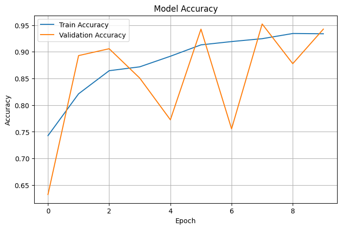
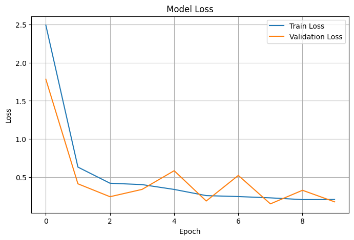
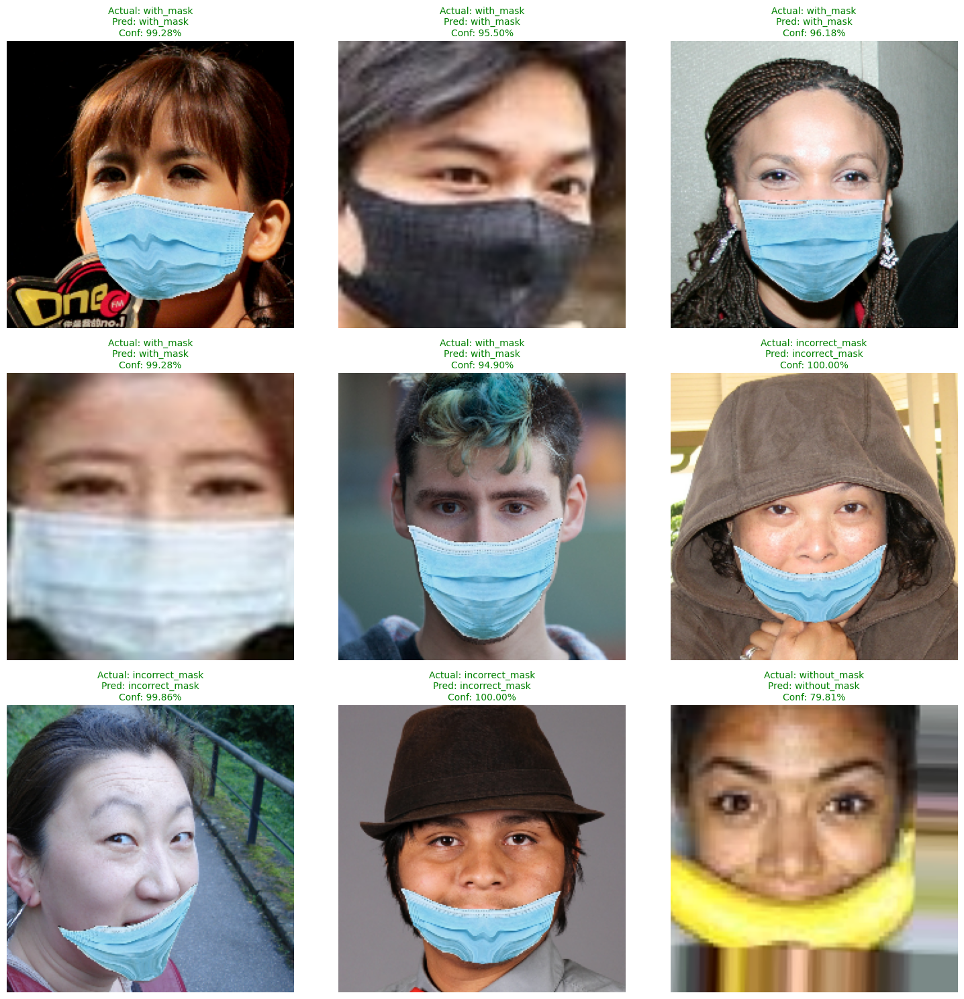

<h1 align="center">😷 Face Mask Detection using Convolutional Neural Networks (CNN)</h1>

<p align="center">
A Deep Learning project that classifies facial images into three categories:
<br><br>

😷 <b>With Mask</b> &nbsp;&nbsp;|&nbsp;&nbsp;
❌ <b>Without Mask</b> &nbsp;&nbsp;|&nbsp;&nbsp;
⚠️ <b>Incorrect Mask</b>

</p>

<p align="center">


</p>

---

# 📌 Project Overview

This project implements a **Convolutional Neural Network (CNN)** from scratch to detect whether a person is:

- 😷 **With Mask**
- ❌ **Without Mask**
- ⚠️ **Incorrectly Wearing a Mask**

The model was trained using **TensorFlow/Keras** on a face mask dataset containing **14,536 images** with varying lighting conditions, backgrounds, image resolutions, and face orientations.

The project demonstrates the complete deep learning workflow including dataset preprocessing, data augmentation, CNN model development, training, evaluation, and prediction.

---

# 🚀 Features

- ✅ Three-Class Face Mask Classification
- ✅ Custom CNN Architecture
- ✅ TensorFlow/Keras Implementation
- ✅ Image Preprocessing & Normalization
- ✅ Data Augmentation
- ✅ Automatic Train / Validation / Test Split
- ✅ Model Evaluation
- ✅ Prediction on Unseen Images
- ✅ Model Saved in `.keras` Format

---

# 📂 Dataset Structure

```
FMD_DATASET/
│
├── with_mask/
│   ├── simple/
│   └── complex/
│
├── without_mask/
│   ├── simple/
│   └── complex/
│
└── incorrect_mask/
    ├── mc/
    └── mmc/
```

### Dataset Information

| Property | Value |
|----------|-------|
| Total Images | **14,536** |
| Classes | **3** |
| Image Size | Resized to **224 × 224** |
| Split | Train / Validation / Test |

---

# 🛠 Technologies Used

| Technology | Purpose |
|------------|---------|
| Python | Programming Language |
| TensorFlow | Deep Learning |
| Keras | CNN Development |
| OpenCV | Image Processing |
| NumPy | Numerical Computation |
| Matplotlib | Data Visualization |
| KaggleHub | Dataset Download |

---

# 🧠 CNN Architecture

```
Input (224×224×3)
        │
Data Augmentation
        │
Rescaling
        │
Conv2D (32)
        │
BatchNormalization
        │
MaxPooling2D
        │
Conv2D (64)
        │
BatchNormalization
        │
MaxPooling2D
        │
Conv2D (128)
        │
BatchNormalization
        │
MaxPooling2D
        │
Conv2D (256)
        │
BatchNormalization
        │
MaxPooling2D
        │
Flatten
        │
Dense (256)
        │
Dropout (0.5)
        │
Dense (128)
        │
Dropout (0.3)
        │
Dense (3)
        │
Softmax
```

---

# 📊 Training Pipeline

- Dataset Exploration
- Image Analysis
- Image Resizing
- Pixel Normalization
- Data Augmentation
- CNN Training
- Model Evaluation
- Prediction on Test Images
- Save Trained Model

---

# 📈 Model Performance

| Metric | Value |
|---------|-------|
| Optimizer | Adam |
| Loss Function | Sparse Categorical Crossentropy |
| Evaluation Metric | Accuracy |
| Model Format | `.keras` |

The training and validation curves indicate that the model converges well with minimal overfitting.

---


# 📊 Results

## 📈 Training Accuracy & Validation Accuracy

The figure below illustrates the learning progress of the CNN throughout the training process. The training and validation accuracy curves show that the model learns effectively while maintaining good generalization on unseen data.

<p align="center">

</p>

---

## 📉 Training Loss & Validation Loss

The loss curves demonstrate a consistent decrease in training loss while the validation loss remains relatively low, indicating stable convergence and minimal overfitting.

<p align="center">

</p>
---

## 🖼️ Sample Predictions on Test Images

The following examples show predictions made by the trained CNN on unseen test images.

Each prediction includes:

- ✅ Ground Truth Label
- 🤖 Predicted Label
- 📊 Prediction Confidence

Green-colored labels indicate correct predictions.

<p align="center">

</p>

---
---

# 📁 Project Structure

```
Face-Mask-Detection/
│
├── dataset/
│
├── images/
│   ├── accuracy.png
│   ├── loss.png
│   ├── predictions.png
│   └── model_summary.png
│
├── models/
│   └── face_mask_detector.keras
│
├── notebook.ipynb
│
├── requirements.txt
│
└── README.md
```

---

# 🎯 Future Improvements

- 🎥 Real-Time Webcam Detection
- 😊 Face Detection using MediaPipe
- 🚀 Transfer Learning (MobileNetV2 / EfficientNet)
- 📱 TensorFlow Lite Deployment
- 🌐 Flask / Streamlit Web Application
- 📦 Docker Deployment

---

# 📜 License

This project is developed for **educational and research purposes**.

---

# 👨‍💻 Author

**Shimanto Shaha**

🎓 Computer Science & Engineering (CUET)

GitHub: https://github.com/Shimantoshaha01

---

## ⭐ If you found this project useful, please consider giving it a Star!
